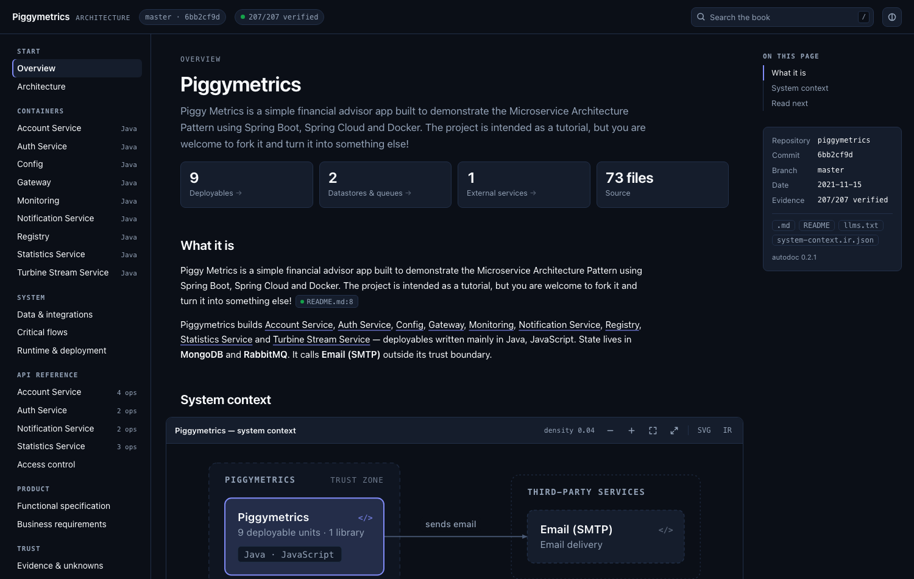
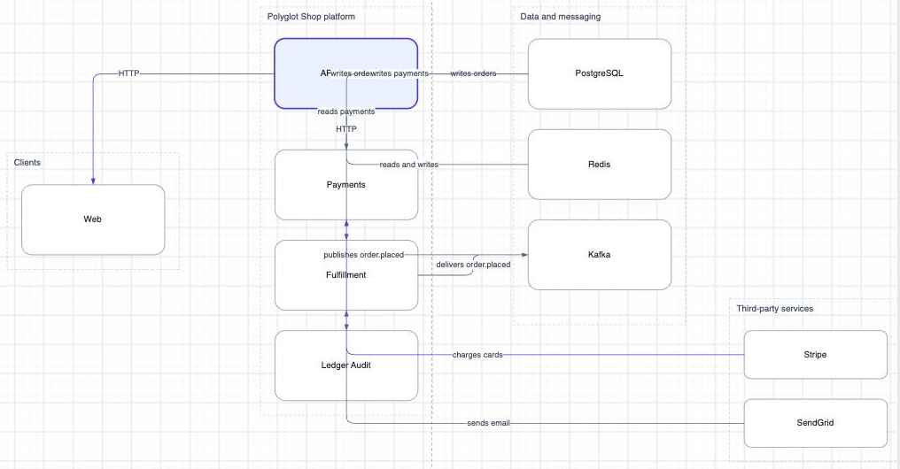
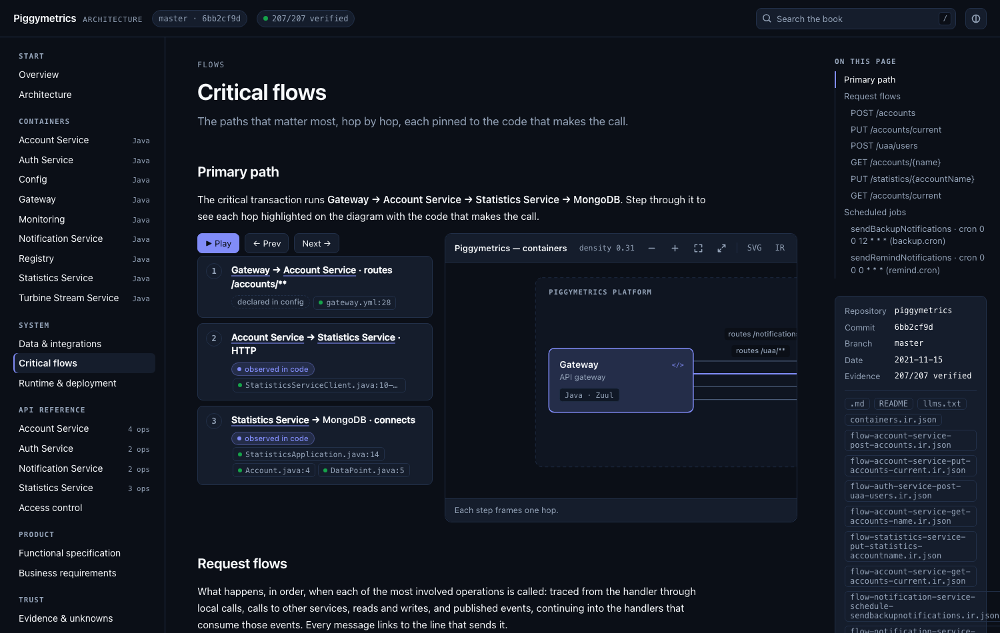

<h1> nunki</h1>

[](https://github.com/sadaramk/nunki/actions/workflows/ci.yml)
[](LICENSE)
[](https://sadaramk.github.io/nunki/)

**Architecture documentation generated from source code.** Every claim links to the file and line
it came from, and every citation is verified against the commit — so documentation that has gone
wrong fails the build instead of misleading a reader.

[](https://sadaramk.github.io/nunki/examples/piggymetrics/)

### [Browse a live book →](https://sadaramk.github.io/nunki/)

Generated by CI from the current `main`: [Spring PetClinic](https://sadaramk.github.io/nunki/examples/spring-petclinic/) ·
[PiggyMetrics](https://sadaramk.github.io/nunki/examples/piggymetrics/) ·
[a polyglot demo](https://sadaramk.github.io/nunki/examples/polyglot-shop/) ·
[nunki's own source](https://sadaramk.github.io/nunki/examples/nunki/)

## Try it

```bash
brew install sadaramk/nunki/nunki             # macOS and Linux

nunki generate path/to/repo                   # → path/to/repo/docs/architecture/
open path/to/repo/docs/architecture/index.html
```

Or a single static binary, no toolchain and no runtime:

```bash
curl -fsSL https://github.com/sadaramk/nunki/releases/latest/download/install.sh | sh
```

Or build it: `cargo install --git https://github.com/sadaramk/nunki nunki-cli`.

> On macOS, prefer Homebrew or the installer. The binaries are not notarized, so an archive
> downloaded through a **browser** is quarantined and Gatekeeper kills it — silently, with exit 137.
> Homebrew and `curl` fetch without setting that flag. If you did download it by hand:
> `xattr -d com.apple.quarantine ./nunki`.

Docker works too, and is how the project tests itself:
`docker compose run --rm nunki generate /repo --out /repo/docs/architecture`

## Keep it true in CI

```yaml
- uses: sadaramk/nunki@v0.3.0
  with:
    out: docs/architecture
```

Pinning the action pins the binary: `@v0.3.0` runs that build, verified against the checksum
published with it. `@v0` tracks the newest 0.x instead.

Exits 1 when regenerating would change the book, or when a citation no longer matches the code.
Committing the book does not invalidate it, and neither does a commit that changes nothing it
describes: a book records the commit it documents rather than `HEAD`.

## Review what a change does to the architecture

```yaml
- uses: sadaramk/nunki@v0.3.0
  with:
    command: diff
    args: --base ${{ github.event.pull_request.base.sha }}
```

It scans both revisions and compares the models rather than the rendered pages, so a reordered table
is not a change and a new route is one line:

> **API operations**
> - added **payments GET /charges/{id}**
> - changed **api-gateway POST /checkout** — response gains `trackingUrl`; success status `201` →
>   `202`; no authentication requirement is recognised any more

Routes, request and response types, authentication, tables, columns, services and the connections
between them. Markdown by default for a PR comment, `--json` for a bot, `--exit-code` to gate.

## Take a diagram into draw.io

```bash
nunki export docs/architecture/diagrams/containers.ir.json
# → containers.drawio · open with draw.io
```



*[That exact file](examples/polyglot-shop/diagrams/containers.drawio) — open it in draw.io to get
this.*

Real shapes you can move. The boundaries, sizes, positions, edge routes and label placements are the
ones nunki worked out for the book, so the diagram opens looking like the figure it came from
rather than as a knot for draw.io to untangle. The evidence travels too: every shape carries its
`file:line` as shape data (right-click → Edit Data) and links to the line it came from, so a diagram
pasted into a slide can still be checked.

`--format drawio-csv` writes a CSV for draw.io's *Extras → Insert → Advanced → CSV* instead, to merge
into a drawing you already have. CSV cannot express a route or a label position, so draw.io lays that
one out itself and it reads less well.

One way, deliberately: the source stays authoritative about the architecture, and the drawing is
yours.

[](https://sadaramk.github.io/nunki/examples/piggymetrics/#/flows)

*Each hop in a request flow is pinned to the line that makes the call.*

## What you get

One directory you commit beside the code:

- **`index.html`** — the interactive book: navigation, figure drill-down, citation popovers, flow
  walkthrough, search. Self-contained and offline.
- **`pages/*.md`** — a Markdown mirror, so the same content reads on GitHub and diffs in review.
- **`diagrams/*.ir.json`** — the typed `DiagramIR` behind every figure. Edit one by hand and it is kept.
- **`llms.txt`** — the book as context for agents. `nunki serve` also runs an
  [MCP server](https://sadaramk.github.io/nunki/start.html) on stdio.

Languages: Rust, TypeScript, Go, Python, Java, Kotlin, C# —
[what it reads →](https://sadaramk.github.io/nunki/support.html)

A book says on its first page how much of the source it read. Where nunki has no parser — C++, Dart,
Ruby, Svelte and the rest — those files are counted and named, because a book about the third of a
system that happened to be parseable should not look like a book about the system. Below a tenth
read it refuses outright; `--allow-partial` overrides that.

## Commands

| Command | What it does |
|---------|--------------|
| `nunki init [PATH]` | Write `nunki.toml` (output dir, theme, accent, depth, density ceiling). |
| `nunki analyze [PATH] [--depth system\|container\|component] [--focus ID] [--json FILE] [--emit-ir FILE] [--include-tests]` | Scan and print the C4 summary; optionally write the full report and a draft IR. |
| `nunki validate IR [--repo PATH] [--strict] [--json]` | Diagnostics with suggestions and patches. Exit 1 on errors. |
| `nunki render IR [-o OUT] [--format html\|svg] [--accent indigo\|coral\|#hex] [--repo PATH]` | Validate, verify evidence, render. Nothing is written if validation fails. |
| `nunki generate [PATH] [--out DIR] [--include-tests] [--allow-partial] [--json]` | Write the architecture book. Rewrites only changed files; keeps hand-edited diagram IR. |
| `nunki check [PATH] [--out DIR] [--json]` | Exit 1 when regenerating would change the book or a citation is stale. |
| `nunki diff [PATH] [--base REV] [--head REV] [--json] [--exit-code]` | What changed architecturally between two revisions, as a PR comment. |
| `nunki export IR [--format drawio\|drawio-csv] [-o FILE] [--repo PATH]` | Write a diagram for draw.io, carrying the book's layout and the evidence. |
| `nunki verify FILE:LINE[-END]... [--repo PATH] [--commit SHA]` | Check evidence for drift. Exit 1 unless all verified. |
| `nunki schema` | Print the DiagramIR JSON Schema. |
| `nunki serve` | MCP server over stdio. |

Exit codes: `0` success · `1` validation/verification failed · `2` usage or I/O error.

## Proven on real repositories

Run against etcd, MinIO, Caddy, Spring PetClinic, PiggyMetrics, wild-workouts and others; each
finding became a fix and a regression fixture. The results, and the heuristics behind them, are in
[HEURISTICS.md](HEURISTICS.md).

## The name

Nunki is the star σ Sagittarii. In Sumerian cuneiform **NUN.KI** writes the name of Eridu, the holy
city on the Euphrates, and `MUL.NUNKI` — "star of the city of Eridu" — appears in Babylonian star
lists. The IAU made *Nunki* the star's official name in 2016.

It is widely called the oldest star name still in use. The truth is better: the name was lost,
recovered from tablets by archaeologists, and popularised by R. H. Allen in 1899 — whose
Mesopotamian etymologies are not considered reliable — and it is now thought the original name
referred to an asterism over in Vela, not to this star at all.

A claim repeated confidently for a century, traceable to a single popular source, and partly wrong
once you follow it back. That is the failure this project exists to catch, so the name earns itself.

## Documentation

[Getting started](https://sadaramk.github.io/nunki/start.html) ·
[Roadmap](ROADMAP.md) ·
[Board](https://github.com/users/sadaramk/projects/3) ·
[How it works](https://sadaramk.github.io/nunki/how.html) ·
[What it reads](https://sadaramk.github.io/nunki/support.html) ·
[Heuristics and limits](HEURISTICS.md) ·
[Contributing](CONTRIBUTING.md) ·
[Changelog](CHANGELOG.md)

## License

MIT — see [LICENSE](LICENSE). Generated books embed excerpts of the documented repository's source.
